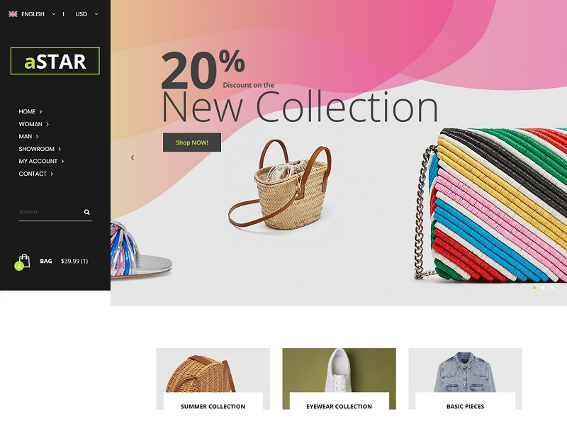
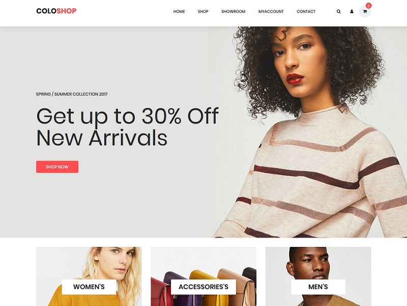
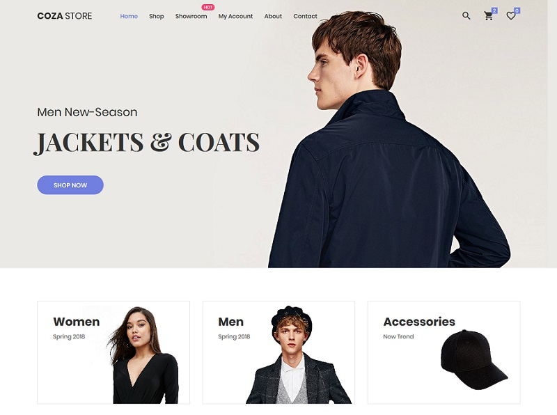
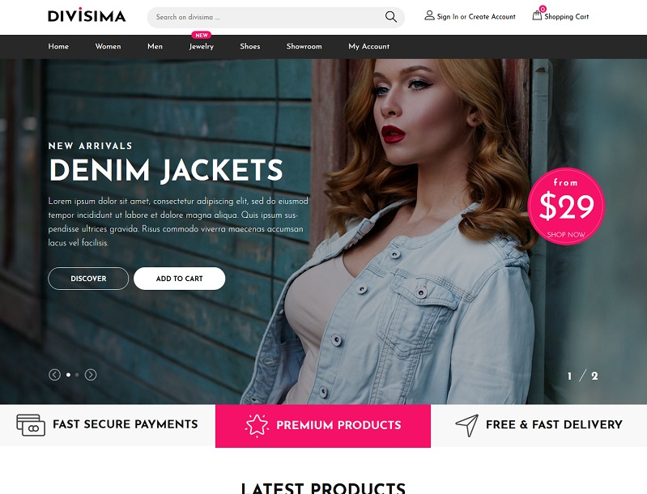
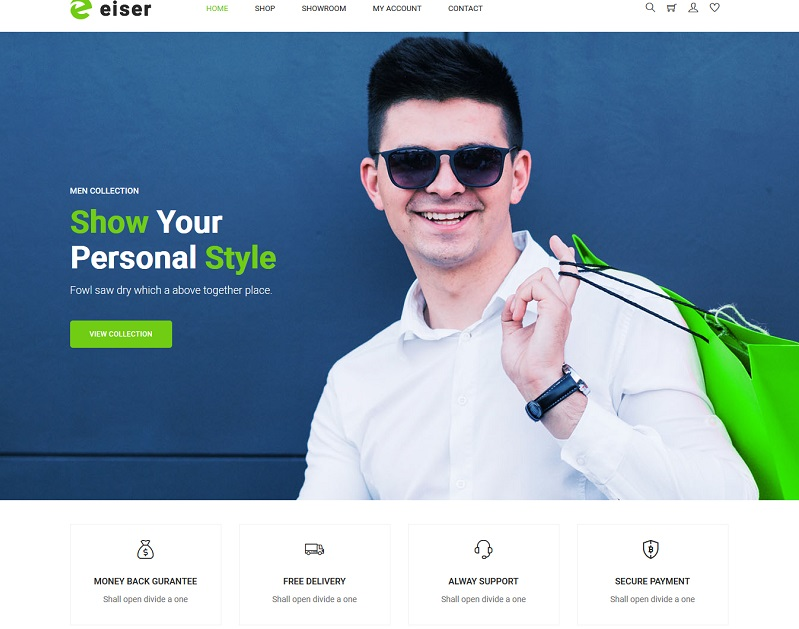
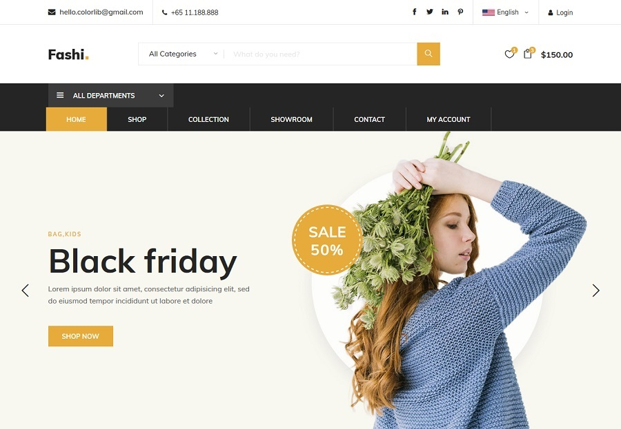
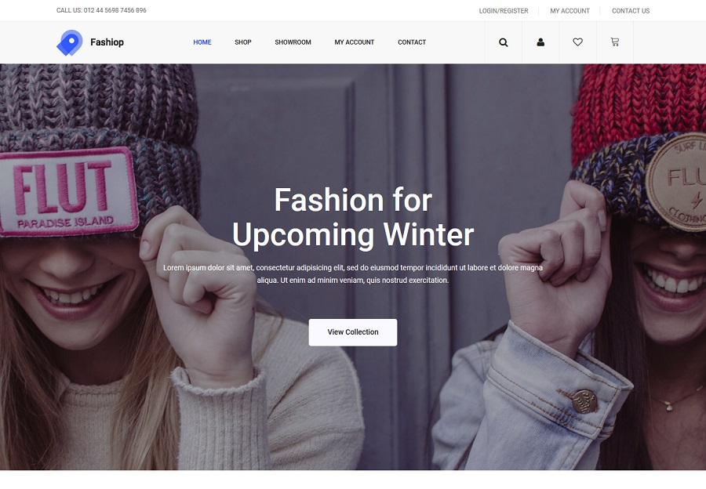

## aStar

#### Template Details:
* **Author:** Colorlib
* **Licence:** CC BY 3.0
* **Credits:** Images from Unsplash.

#### Description:

  aStar has a sticky left sidebar navigation, big slider, parallax effect, newsletter subscription box and a features-stuffed footer section.

  Along with the up-to-the-minute home, aStar also provides a full showroom section which you can use to display product drops, and style trends. 

  Speaking of which, you can use aStar for fashion, furniture, accessories, electronics and all sorts of other online stores with ease.

  ## coloShop

.

#### Template Details:
* **Author:** Colorlib
* **Licence:** CC BY 3.0
* **Credits:** Images from Unsplash.

#### Description:

  ColoShop is a free Bootstrap eCommerce website template that you can use to sell any goods online. 
  
  This template can be ported to a platform of your choice or as a standalone website. 
  
  ColoShop is one of the most versatile free eCommerce website templates you will find today. 

   ## coza Store

.

#### Template Details:
* **Author:** Colorlib
* **Licence:** CC BY 3.0
* **Credits:** Images from Unsplash.

#### Description:

When it comes to selling apparel, Coza Store free online fashion store website template is your best approach to realizing it. It is a minimal eCommerce website template with elegance and simplicity being its main characteristics. But there is way more to Coza Store than just the two of them. Displaying items on the web has never been more attention-grabbing. The web design makes sure buyers undergo a distraction-free shopping experience no matter the device.

Coza Store is responsive and stacked with an assortment of handy and powerful features. See its beauty in action by heading over to the preview page. If fashion is your passion, now you know how to turn it into a lucrative business. Start with Coza Store and see an unbelievable outcome.

 ## Divisima

.

#### Template Details:
* **Author:** Colorlib
* **Licence:** CC BY 3.0
* **Credits:** Images from Unsplash.

#### Description:

With an enticing and unique full-screen slider, you will win over new potential shoppers easily. Moreover, Divisima comes with a drop-drown menu, cart, checkout and contact pages, showroom section and a widget-rich footer. Link your website with all your social media accounts and increase your potential through the roof. Start your online clothing store with Divisima and realize your idea once and for all.

 ## Eiser

.

#### Template Details:
* **Author:** Colorlib
* **Licence:** CC BY 3.0
* **Credits:** Images from Unsplash.

#### Description:

Eiser is also a mobile-ready web design that works fluently on smartphones, tablets and desktop computers. It also follows other rules and regulations, like retina-readiness, cross-browser compatibility and top-notch performance. Last but not least, of course, Eiser is also equipped with a functional contact form and Google Maps.

 ## Fashi

.

#### Template Details:
* **Author:** Colorlib
* **Licence:** CC BY 3.0
* **Credits:** Images from Unsplash.

#### Description:

 Fashi comes with a slider, tons of practical inner page layouts, countdown timer, social media icons and drop-down menu. You can also start a showroom where you display new product drops, share outfits and other whatnots. Last but not least, Fashi includes Google Maps and a functional contact form, too.

 ## Fashiop

.

#### Template Details:
* **Author:** Colorlib
* **Licence:** CC BY 3.0
* **Credits:** Images from Unsplash.

#### Description:

 Fashiop is a modern website template that practices all the latest technologies and web practices to ensure first-class shopping experience. No matter where they come from, Fashiop makes sure your items are displayed superbly for everyone to get the most out of your web store. Start taking orders ASAP thanks to the always remarkable Fashiop.

## Fashiop

.

#### Template Details:
* **Author:** Colorlib
* **Licence:** CC BY 3.0
* **Credits:** Images from Unsplash.

#### Description:

 Fashiop is a modern website template that practices all the latest technologies and web practices to ensure first-class shopping experience. No matter where they come from, Fashiop makes sure your items are displayed superbly for everyone to get the most out of your web store. Start taking orders ASAP thanks to the always remarkable Fashiop.

 ## Fashiop

.

#### Template Details:
* **Author:** Colorlib
* **Licence:** CC BY 3.0
* **Credits:** Images from Unsplash.

#### Description:

 Fashiop is a modern website template that practices all the latest technologies and web practices to ensure first-class shopping experience. No matter where they come from, Fashiop makes sure your items are displayed superbly for everyone to get the most out of your web store. Start taking orders ASAP thanks to the always remarkable Fashiop.

 ## Fashiop

.

#### Template Details:
* **Author:** Colorlib
* **Licence:** CC BY 3.0
* **Credits:** Images from Unsplash.

#### Description:

 Fashiop is a modern website template that practices all the latest technologies and web practices to ensure first-class shopping experience. No matter where they come from, Fashiop makes sure your items are displayed superbly for everyone to get the most out of your web store. Start taking orders ASAP thanks to the always remarkable Fashiop.

